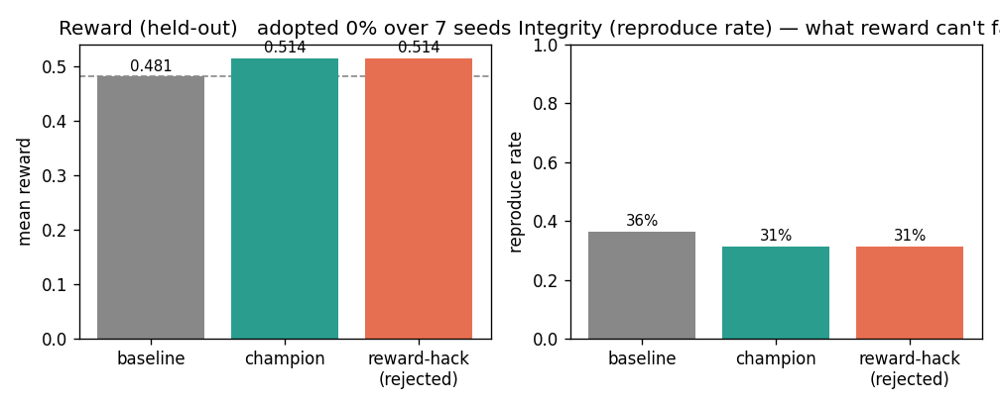

# crucible

**A self-improvement loop for LLM agents that refuses to trust reward.**

Most "self-improving agent" projects show a reward number going up. But reward
can be gamed: an agent can satisfy a task's automated checker (the *oracle* that
grants reward) without producing a result that actually holds up. A loop that
optimizes reward alone will happily amplify those non-reproducible "wins".

`crucible` cross-checks every candidate policy against a second signal reward
**cannot fake** — the **reproduce rate** (did oracle-passing episodes hold up on
re-run?). Its champion gate adopts a change only if it improves reward *and*
preserves both per-family performance and reproducibility. The headline demo
runs in seconds, on the Python standard library alone — no LLM, no GPU, no network.

```text
$ python -m demo.self_improve
[1/4] in the logs: 69% of oracle-passing episodes did NOT reproduce
      (reward still paid out — optimizing reward alone amplifies this)
[2/4] champion (seed 0):
      reward    0.481 -> 0.514 held-out  (in-sample 0.541)
      integrity 36% -> 31% reproduce rate
      [gate] REJECT: integrity regression (reproduce rate -0.051) (reward Δ=+0.033, integrity Δ=-0.051)
[3/4] reward-hacking probe (chases reward into non-reproducible wins):
      reward-only gate : ADOPT  (improves reward without family or integrity regression)
      integrity gate   : REJECT  (integrity regression (reproduce rate -0.051))
[4/4] multi-seed (7 splits): adopted 0% of the time
      reward Δ    +0.017 ± 0.027
      integrity Δ -0.086 ± 0.045
```



Read what the demo is actually saying: the reward-maximizing routing **does**
raise reward (+0.017 on average) — and it erodes reproducibility every single
time (−0.086 ± 0.045 across 7 splits). A reward-only gate would adopt it. The
integrity-aware gate rejects it on all 7 splits. **That refusal is the feature.**
(The numbers come from a real but small, partly-synthetic log sample — see
[honesty notes](#honesty-notes-read-this); the mechanism is the point, not the
exact figures.)

## The loop

```
logged episodes ─► split ─► propose on train ─► held-out reward + integrity ─► gate
   (replay)                  (best strategy/family)   (two orthogonal signals)   (adopt / reject)
```

1. **Replay** (`data/replay_sample.jsonl`) — 204 anonymized records from real
   agent runs: per episode the strategy used, task family, a feature vector, the
   reward earned, and — crucially — whether the result was reproducible
   (`oracle_pass` / `repro_pass`).
2. **Propose on train** (`crucible/learning/routing.py`) — on a training split,
   per task family, route to the highest-mean-reward strategy.
3. **Estimate held-out** — score that routing on episodes it never saw, on **two
   axes**: reward (`routing.evaluate_routing`) and reproduce rate
   (`integrity.routed_reproduce_rate`). No credit is invented where the data
   can't support it.
4. **Gate** (`crucible/learning/gate.py`) — adopt only if held-out reward
   improves, no family regresses, **and** reproducibility is not eroded. The same
   gate is shown rejecting a controlled reward-hacking policy.
5. **Multi-seed** (`crucible/learning/loop.py`) — repeat over several stratified
   splits so the verdict carries a variance, not a single lucky number.

The optional `PolicyNetwork` learned router (the project's real model) can also
be trained over the features; it is reported as a sanity signal, not a guarantee.

## Quickstart

```bash
pip install -e .                  # zero runtime deps for the headline demo
python -m demo.self_improve       # the loop, in seconds

pip install -e ".[learn,charts]"  # optional: torch (learned router) + matplotlib
python -m demo.self_improve --chart
pytest                            # 17 deterministic tests, no torch needed
```

## Honesty notes (read this)

This project is deliberately modest about what it claims, because that honesty
*is* the point.

- **This is offline and off-policy.** We only observe the reward of the strategy
  that was actually chosen, never the counterfactual reward of the alternatives
  on the same episode. The per-family estimate is therefore confounded and only
  trustworthy with enough support per cell. **The gate exists precisely because
  this estimate can be wrong.**
- **This is not autonomous self-improvement.** It is a bounded, auditable loop: a
  human runs it, reads the gate's verdict, and decides. No claim is made about an
  agent improving itself unsupervised.
- **The learned router is a sanity signal.** Train-set accuracy over strategies
  is reported as a smoke check, not as evidence that routing generalizes.

See [`docs/LIMITATIONS.md`](docs/LIMITATIONS.md) for the full account.

## Background

`crucible` is the distilled, publishable core of a larger private research
codebase (a self-hosted, multi-strategy LLM agent with Planner→Agent→Reviewer,
file memory, and a DuckDB knowledge base). The components here — `PolicyNetwork`,
the reward functions, the champion-gate logic — are lifted from that system and
wired into one small, fully reproducible demonstration.

## License

MIT — see [`LICENSE`](LICENSE).
